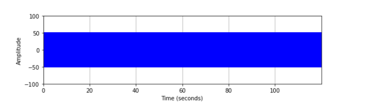
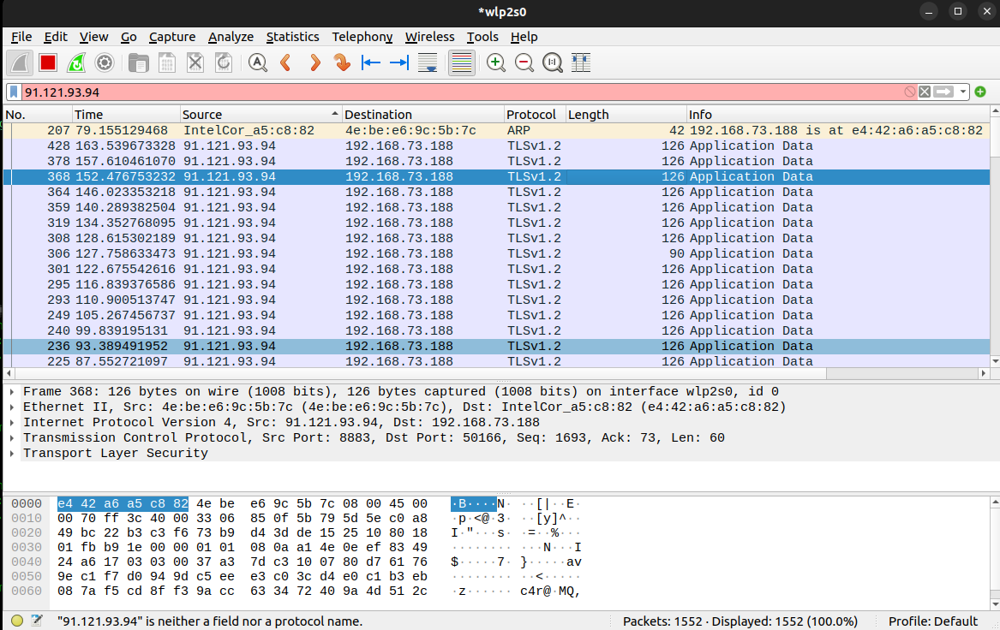

# IoT Base System

### Individual Assingment (IoT Algorithm and Services)

##### Georgi Todorov Dimitrov ID 1890039

This GitHub repository contains the code for the individual assignment of IoT Algorithms and Services.
The project is composed by the following parts:

1. Signal Generation code
2. Code for the ESP32s3 :
	- Oversample the signal;
	- Compute the Fourier Trasform (FFT) and use the Sampling Theorem for adjust the sampling frequency; 
	- Compute the average of the sampled signal;
	- Comunication with MQTT Brocker through MQTTS (MQTT over TLS protocol);
	- Ping with ICMP code for measure the end-to-end delay for trasmitting message;

The directory and the code are organise in this way:

    iot-base-system
            |
            |--- experiments
            |--- signal-generator                 
            |--- esp-code
			| --- icmp_echo  ---->   Code for use ICMP protocol and for measure the end-to-end 
                                             delay between ESP32s3 and test.mosquitto.org (the mqtt brocker)
               	| --- iot-base-system        
    			    | --- main
    				    | --- main.c ----> This contain the code all the code for:
    								- oversampling
    								- fft and adapt the sampling 
    								- mqtt comunication
                

### Experiments

#### 1. Signal Generation 
The Signal Generation is make by python code on jupyter-notebook that generate an audio output. The audio output is a signal generated as a sum of multiple sinusoids given by the formula:

$$audio(t) = \sum_{k=1}^n a_k sin(2\pi t f_k+ \phi_k)$$

In my experiment the parameters of this formula are n=1, a=50, f=450. 

	

#### 2. Maximum Sampling Frequency
The next step is oversampling the signal and measure the maximum sampling rate of the device, for do this I use the `esp_timer.h` library and the `esp_timer_get_time()` for get the time at the start $$t_s$$ and the end $$t_s$$ of the sampling and get the sampling rate by this formula:

$$F_s=\frac{N}{t_f - t_s}$$

With some experience I measure that the maximum sampling frequency is 25000 Hz and the computation time for each iteration is 40 microsec how we can see from the follow result:

    I (508) ESP32s3: TIMER_STOP delay: 0.163893 s, delay for iter 0.000040 s, frequency 24991.916016 Hz
    I (1168) ESP32s3: TIMER_STOP delay: 0.163724 s, delay for iter 0.000040 s, frequency 25017.712891 Hz
    I (1828) ESP32s3: TIMER_STOP delay: 0.163712 s, delay for iter 0.000040 s, frequency 25019.546875 Hz
    I (2488) ESP32s3: TIMER_STOP delay: 0.163744 s, delay for iter 0.000040 s, frequency 25014.656250 Hz
    I (3148) ESP32s3: TIMER_STOP delay: 0.163725 s, delay for iter 0.000040 s, frequency 25017.558594 Hz
    I (3808) ESP32s3: TIMER_STOP delay: 0.163723 s, delay for iter 0.000040 s, frequency 25017.865234 Hz
    I (4468) ESP32s3: TIMER_STOP delay: 0.163718 s, delay for iter 0.000040 s, frequency 25018.628906 Hz
    I (5128) ESP32s3: TIMER_STOP delay: 0.163716 s, delay for iter 0.000040 s, frequency 25018.935547 Hz
    I (5788) ESP32s3: TIMER_STOP delay: 0.163720 s, delay for iter 0.000040 s, frequency 25018.324219 Hz
    I (6448) ESP32s3: TIMER_STOP delay: 0.163717 s, delay for iter 0.000040 s, frequency 25018.781250 Hz
    I (7108) ESP32s3: TIMER_STOP delay: 0.163714 s, delay for iter 0.000040 s, frequency 25019.240234 Hz
    I (7768) ESP32s3: TIMER_STOP delay: 0.163741 s, delay for iter 0.000040 s, frequency 25015.117188 Hz
    I (8428) ESP32s3: TIMER_STOP delay: 0.163745 s, delay for iter 0.000040 s, frequency 25014.503906 Hz
    I (9088) ESP32s3: TIMER_STOP delay: 0.163734 s, delay for iter 0.000040 s, frequency 25016.183594 Hz
    I (9748) ESP32s3: TIMER_STOP delay: 0.163732 s, delay for iter 0.000040 s, frequency 25016.492188 Hz
    I (10408) ESP32s3: TIMER_STOP delay: 0.163747 s, delay for iter 0.000040 s, frequency 25014.199219 Hz
    I (11068) ESP32s3: TIMER_STOP delay: 0.163730 s, delay for iter 0.000040 s, frequency 25016.796875 Hz
    I (11728) ESP32s3: TIMER_STOP delay: 0.163757 s, delay for iter 0.000040 s, frequency 25012.671875 Hz
    I (12388) ESP32s3: TIMER_STOP delay: 0.163735 s, delay for iter 0.000040 s, frequency 25016.031250 Hz
    I (13048) ESP32s3: TIMER_STOP delay: 0.163729 s, delay for iter 0.000040 s, frequency 25016.949219 Hz

#### 3. Minimum Sampling Frequency
Once the signal is sampled I compute the FFT and using the Z-Score analysis and the Sampling theorem I identify the optimal sampling frequency with the Nyquist theorem:

$$fs > 2 * f_{max}$$

In my experiment the optimal theorical frequency is Fs = 2*450 Hz = 900 Hz , but the better result that I obtain is 6000Hz using as z threashold Threashold = 10. With other threashold like 0, 3, 3.5, ... I obtain frequency that is more bigger than the optimal threashold. 
For compute the optimal interval for sampling I use the follow formula :

$$t_s= \frac{1}{f_{s}} - d_c$$

Where $$t_s$$ is the sample interval, $$f_s$$ is the optimal sample frequency and the $$d_c$$ is the delay for each iteration generated by the computation of the microcontroller and is 40 microsec. 
If I use the `xTaskDelay(ts)` the maximum sampling rate that I can perform is 1000 Hz because this function can accept time bigger than one millisec, for generate delay of the order of microsec I use the function `ets_delay_us(ts)` in the library `rom/ets_sys.h`. 

#### 4. Average Sampling Signal
The agregate function that I use is the square mean, i.e. I compute the mean with the follow formula:

$$E[X^2]=\frac{\sum_{k=1} x^2(k)}{N}$$

The avarage that I measure is the follow:

    TOPIC=sample_1890039
    DATA=AVG AUDIO: 6.211957
    
    TOPIC=sample_1890039
    DATA=AVG AUDIO: 6.235816
    
    TOPIC=sample_1890039
    DATA=AVG AUDIO: 6.207337
    
    TOPIC=sample_1890039
    DATA=AVG AUDIO: 6.230043
    
    TOPIC=sample_1890039
    DATA=AVG AUDIO: 6.230043
    
    TOPIC=sample_1890039
    DATA=AVG AUDIO: 6.202834
    
    TOPIC=sample_1890039
    DATA=AVG AUDIO:  6.235312
    

#### 5. Performance 
##### 5.1 Energy consumption
The energy consumption I measure using a multimeter and the consumption is the follow:
- **Power consumption in oversampling**: 

$$P_{maxsample}=55\ mA * 5 \ V$$

- **Power consumption in adapted sampling**: 

$$P_{sample}=42.6\ mA * 5 \ V$$

- **Power consumption during communication**: 

$$P_{comunication}=47.5\ mA * 5 \ V$$

- **Power total**: 

$$P_{tot}=64\ mA * 5 \ V$$

##### 5.2 Traffic Volume Data
The traffic volume I see with Wireshark, in particular I use the program `mosquitto-client` and `mosquitto-sub` to receve the packet from the broker *test.mosquitto.org* and capture the packet with `Wireshark`. Each packet has a length of 126 byte how can show the follow image:

	

##### 5.3 Traffic End-to-End Latency
For measure the End-to-End latency I use the example of the esp-idf framework of the ICMP protocol and run it on my device and contact the brocker *test.mosquitto.org*

    esp> ping -c 50  test.mosquitto.org 
    64 bytes from 91.121.93.94 icmp_seq=1 ttl=50 time=133 ms
    64 bytes from 91.121.93.94 icmp_seq=2 ttl=50 time=163 ms
    64 bytes from 91.121.93.94 icmp_seq=3 ttl=50 time=190 ms
    64 bytes from 91.121.93.94 icmp_seq=4 ttl=50 time=211 ms
    64 bytes from 91.121.93.94 icmp_seq=5 ttl=50 time=236 ms
    64 bytes from 91.121.93.94 icmp_seq=6 ttl=50 time=258 ms
    64 bytes from 91.121.93.94 icmp_seq=7 ttl=50 time=77 ms
    64 bytes from 91.121.93.94 icmp_seq=8 ttl=50 time=51 ms
    64 bytes from 91.121.93.94 icmp_seq=9 ttl=50 time=127 ms
    64 bytes from 91.121.93.94 icmp_seq=10 ttl=50 time=52 ms
    64 bytes from 91.121.93.94 icmp_seq=11 ttl=50 time=177 ms
    64 bytes from 91.121.93.94 icmp_seq=12 ttl=50 time=198 ms
    64 bytes from 91.121.93.94 icmp_seq=13 ttl=50 time=51 ms
    64 bytes from 91.121.93.94 icmp_seq=14 ttl=50 time=245 ms
    64 bytes from 91.121.93.94 icmp_seq=15 ttl=50 time=270 ms
